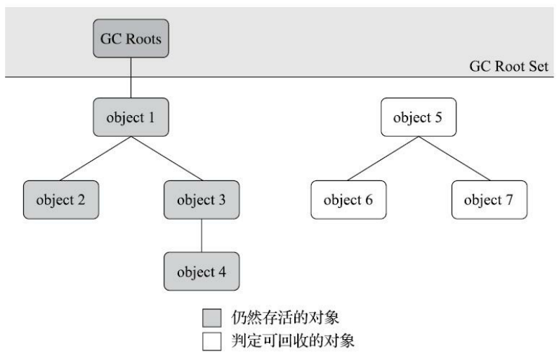
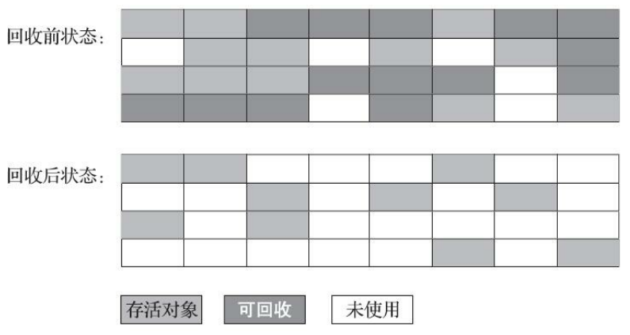
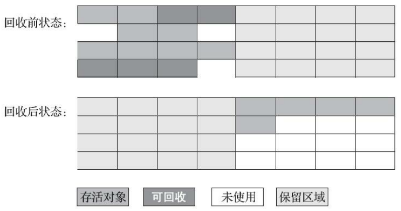
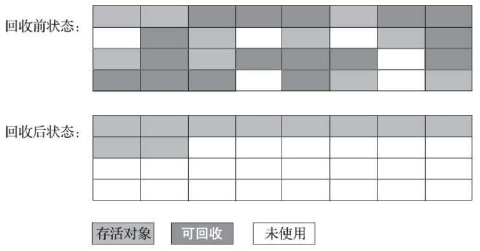

# 垃圾收集算法

垃圾收集需要完成的三件事情：

+ 哪些内存需要回收？
+ 什么时候回收？
+ 如何回收？

**程序计数器**、**虚拟机栈**、**本地方法栈**三个区域随线程而生，随线程而灭。栈帧随方法进入创建，随方法退出销毁。每个栈帧需要分配的内存大小在编译期已经由编译器计算并确定下来，因此这三个区域的内存分配和回收都是**确定**的，*它们不是垃圾收集器需要管理的区域*。

**Java堆**和**方法区**（Java堆的一个逻辑部分）两个区域充满不确定性。执行某个方法某个条件分支时需要创建多少对象加载多少类，都只有运行期间才知道。这两个区域的内存分配和回收是**动态**的，*它们是垃圾收集器所关注的对象*。

## 对象已死？

**哪些内存需要回收？**垃圾收集器回收的正是那些“死去”的对象。（“死去”即不可能在通过任务途径被使用的对象）

### 引用计数算法

给对象添加一个引用计数器，每当被引用时，计数器加一；引用失效时，计数器减一。*引用计数算法需要占用额外内存空间进行计数，但是它的原理简单，判定效率高*。

单纯的引用计数很难解决对象之间**互相循环引用的问题**，要使其正常工作还需要考虑很多其他例外情况，配合大量额外处理。

Java虚拟机中并不是通过引用计数算法来判断对象是否存活的。

### 可达性分析算法

可达性分析算法的基本思路是从一系列被称为**GC Roots**的对象出发，根据引用关系向下搜索，搜索过的路径称为**引用链**，那些不能通过引用链关联到GC Roots的对象就是不可能再被使用的“垃圾”。

Java中固定可作为GC Roots的对象包括：

+ 栈帧中的本地变量表中引用的对象，比如Java方法的参数、局部变量、临时变量等。
+ 方法区中的类的静态属性引用的对象，比如Java类的引用类型静态变量。
+ 方法区中常量引用的对象，比如字符串常量池里的引用。
+ 本地方法栈中JNI引用的对象，比如本地方法中的对象。
+ Java虚拟机内部的引用，比如基本数据类型的Class对象，常驻异常对象以及系统类加载器等。
+ 所有被同步锁持有的对象。
+ 反映Java虚拟机内部情况的JMXBean、JVMTI中注册的回调、本地代码缓存等。

### 细化引用

JDK1.2之前，引用是很传统的定义：如果reference类型的数据中存储的数值代表的是另一块内存的起始地址，那么该reference数据就是某块内存/某个对象的引用。

JDK1.2之后，把Java的引用的概念扩充成强软弱虚4种

+ 强引用

  最传统的引用定义，指程序代码中的引用赋值操作，即`Object obj = new Object()`。

  只要有强引用关系存在，垃圾收集器就永远不会回收通过强引用关联的对象。

+ 软引用

  只被软引用关联的对象在系统发生内存溢出异常前，会把这些对象纳入回收范围中进行回收，如果回收之后内存依旧不足则抛出内存溢出异常。

  通过`SoftReference`类来实现软引用

+ 弱引用

  被弱引用关联的对象在下一次垃圾收集发生时将被回收。

  通过`WeakReference`类来实现弱引用

+ 虚引用

  又被称为幽灵引用或者幻影引用。

  虚引用不会影响其引用的对象的生命周期，但也无法通过虚引用获取对象实例。

  为对象关联虚引用的唯一目的只是在该对象被收集器回收时收到一个系统通知。

  通过`PhantomReference`类来实现虚引用

### 回收方法区

在Java堆中进行一次垃圾收集通常可以回收70%至99%的内存空间，相比之下，方法区回收的苛刻判定条件，该区域的垃圾收集效果远低于Java堆。

方法区的垃圾收集主要针对下面两个部分：

+ 废弃的常量
  + 没有被任何引用关联且虚拟机中也没有其他地方引用这个常量
+ 不再使用的类型
  + 该类所有的实例都已经被回收（Java堆中不存在该类及其派生类的实例时）
  + 加载该类的类加载器已经被回收
  + 该类的`java.lang.Class`对象没有在任何地方被引用，无法在任务地方通过反射访问该类的方法

## 垃圾收集算法

### 分代收集理论

目前商业虚拟机大多采用基于**分代收集**的理论进行设计的垃圾收集器。

分代收集理论是建立在两个分代假说之上的：

1. **弱分代假说**：绝大多数对象都是**朝生夕灭**的。
2. **强分代假说**：熬过越多次垃圾收集过程的对象就越**难消亡**。

如果一个区域的大多数对象都是**朝生夕灭**的，那么把它们集中起来，每次回收时只关注如何保留少量存活的对象，就能**以较低代价回收大量的空间**。

剩下的**难以消亡**的对象，那么也把它们集中起来，便可以**使用较低频率回收**这块区域。

这样以分代收集的方式进行垃圾收集就同时**兼顾了时间开销和内存空间的有效利用**。

商用Java虚拟机基于分代理论实现时，一般至少会把Java堆分为**新生代**和**老年代**两个区域。在新生代中，每次垃圾收集都有大量对象死去，每次经过回收存活下来的少量对象将会逐步**晋升**（*每熬过一轮GC后对象年龄增长一岁，当达到指定值时晋升*）到老年代中存放。

对Java堆进行分代划分后，对不同范围的垃圾收集行为也做了划分：

+ **部分收集（Partial GC）**：指对**部分Java堆**的垃圾收集
  + **新生代收集（Young GC）**：指只对**新生代**的垃圾收集
  + **老年代收集（Old GC）**：指只对**老年代**的垃圾收集（目前仅CMS收集器采用）
  + **混合收集（Mixed GC）**：指对**新生代和部分老年代**的垃圾收集（目前仅G1收集器采用）
+ **整堆收集（Full GC）**：指对**整个Java堆**的垃圾收集

### 标记-清除算法

最早出现也是最基础的垃圾收集算法。

分为**标记**和**清除**两个阶段：

1. 标记
   
   判断对象是否属于垃圾，标记出所有需要回收的对象（或者标记所有不需要回收的对象）。

2. 清除
   
   统一回收所有被标记的对象（或者回收所有未被标记的对象）。

**缺点**：

1. 执行效率不稳定
2. 内存空间碎片化

标记-清除算法的执行过程：

### 标记-复制算法

标记-复制算法将可用内存划分按容量大小分为等份的**两块**，每次**只是用其中的一块**。当这块内存用完了，就将还存活下来的对象**复制到另一块**上面，然后一次性使用过的半区清理掉。

标记-复制算法解决了标记-清除算法的内存空间碎片化问题。

**缺点**：一半空间都是为了实现复制而保留的空间，不能用于正常为对象分配内存，**浪费太多可用内存空间**。

---

目前大多虚拟机使用标记-复制算法实现新生代的垃圾收集。经过研究发现**新生代中98%的对象熬不过第一轮收集**，因此并不需要按照1:1的比例来划分新生代的空间。标记复制算法由于总是存在保留区域，它不适用于内存中所有对象都100%存活的极端情况，所以在老年代一般不直接选用这种算法。

针对新生代中对象**朝生夕灭**的特点，一种更优化的半区复制分代策略被提出。将新生代划分为一块较大的**Eden空间**和两块较小的**Survivor空间**，为对象分配内存时只使用Eden和其中一块Survivor。进行垃圾收集时，被保留下来的对象被复制到另一块Survivor上，然后直接清除掉Eden和第一块Survivor。

HotSpot虚拟机中默认**Eden和两块Survivor的大小比例**为**8:1:1**，即新生代每次可用空间内存占整个新生代90%。当Survivor空间不足以容纳从Eden复制过来的对象时，大多数情况由老年代来分担剩余内存需求。

### 标记-整理算法

针对老年代对象的存亡特征研究出了**标记-整理算法**。标记-整理算法包含两个阶段：

1. **标记**

   和标记-清除算法相同

2. **整理**
   
   将所有存活的对象向内存空间的一端移动，然后直接清理掉边界以外的内存

标记-整理算法的执行过程：

移动存活对象并更新所有引用这些对象的地方将会是一种**负重的操作**，这种操作**必须全程暂停用户应用程序**才能进行，这种停顿被称为“**Stop The World**”。

从内存分配和回收来看，不移动对象则内存分配更复杂，移动对象则内存回收更复杂。

从垃圾收集的停顿时间和程序的吞吐量（用户程序和收集器的效率总和）来看，不移动对象停顿时间更短或者不停顿，移动对象则程序的吞吐量更高。

HotSpot虚拟机中，Parallel Scavenge收集器更关注吞吐量所以基于标记-整理算法实现，CMS收集器则更关注延迟所以基于标记-清除算法实现。

CMS收集器以标记-清除算法为主，当内存空间碎片化严重到影响内存分配时会采用标记-整理算法清理一次。