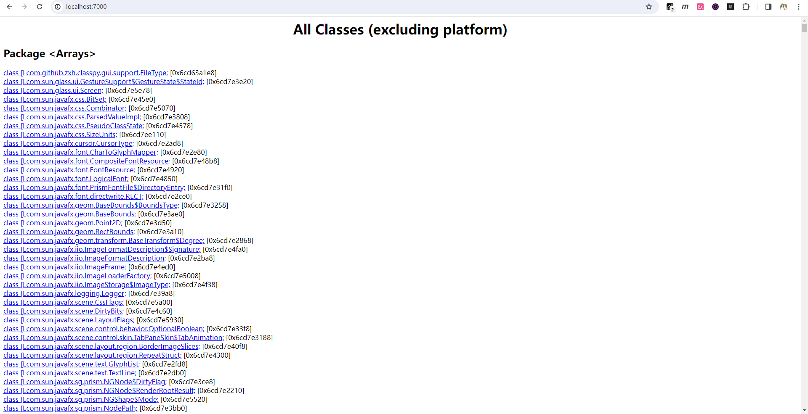

# 虚拟机性能监控、故障处理工具

## 基本故障处理工具

### `jps`：虚拟机进程状况工具

`jps`（JVM Process Status Tool）和UNIX系统中的`ps`命令功能类似：可以列出正在运行的虚拟机进程，并显示虚拟机执行主类名称以及这些进程的本地虚拟机唯一ID（LVMID）。

命令格式：

```
jps [ options ] [ hostid ]
```

`jps`工具主要选项

| 选型 | 作用                                                 |
| ---- | ---------------------------------------------------- |
| -q   | 只输出LVMID，省略主类的名称                          |
| -m   | 输出虚拟机进程启动时传递给主类`main()`函数的参数     |
| -l   | 输出主类的全名，如果进程执行的是JAR包，则输出JAR路径 |
| -v   | 输出虚拟机进程启动时的JVM参数                        |

### `jstat`：虚拟机统计信息监视工具

`jstat`（JVM Statistics Monitoring Tool）是用于监视虚拟机各种运行状态信息的命令行工具。它可以显示本地或者远程虚拟机进程中的类加载、内存、垃圾收集、即时编译等运行时数据，它是运行期定位虚拟机性能问题的常用工具。

命令格式：

```
jstat [ option vmid [interval[s|ms] [count]] ]
```

当VMID是远程虚拟机进程ID时，VMID的格式如下：

```
[protocol:][//]lvmid[@hostname[:port]/servername]
```

参数interval和count代表查询间隔和次数，省略2个参数则只查询一次。

`jstat`工具主要选项

| 选项              | 作用                                                                                                |
| ----------------- | --------------------------------------------------------------------------------------------------- |
| -class            | 监视类加载、卸载数量、总空间以及类装载所耗费的时间                                                  |
| -gc               | 监视Java堆状况，包括Eden区、2个Survivor区、老年代、永久代等的容量，已用空间，垃圾收集时间合计等信息 |
| -gccapacity       | 监视内容与`-gc`基本相同，但输出主要关注Java堆各个区域使用到的最大、最小空间                         |
| -gcutil           | 监视内容与`-gc`基本相同，但输出主要关注已使用空间占总空间的百分比                                   |
| -gccause          | 与`-gcutil`功能一样，但是会额外输出导致上一次垃圾收集产生的原因                                     |
| -gcnew            | 监视新生代垃圾收集状况                                                                              |
| -gcnewcpacity     | 监视内容与`-gcnew`基本相同，输出主要关注使用到的最大、最小空间                                      |
| -gcold            | 监视老年代垃圾收集情况                                                                              |
| -gcoldcapacity    | 监视内容与`-gcold`基本相同，输出主要关注使用到的最大、最小空间                                      |
| -gcpermcapacity   | 输出永久代使用到的最大、最小空间                                                                    |
| -compiler         | 输出即时编译器编译过的方法、耗时等信息                                                              |
| -printcompilation | 输出已经被即时编译的方法                                                                            |

#### `jstat`工具输出列含义

#####  -class

```
jstat -class 8120
Loaded  Bytes  Unloaded  Bytes     Time
  3702  7532.7        0     0.0       0.47
```

| 列名     | 含义                               |
| -------- | ---------------------------------- |
| Loaded   | 加载的类的数量。                   |
| Bytes    | 加载的类所占用的字节数。           |
| Unloaded | 卸载的类的数量。                   |
| Bytes    | 卸载的类所占用的字节数。           |
| Time     | 执行类加载和卸载操作所花费的时间。 |

##### -gc

```
jstat -gc 8120
 S0C    S1C    S0U    S1U      EC       EU        OC         OU       MC     MU    CCSC   CCSU   YGC     YGCT    FGC    FGCT     GCT
 0.0   5120.0  0.0   5120.0 50176.0  22528.0   194560.0    2856.2   21504.0 20831.2 2304.0 2085.3      2    0.004   0      0.000    0.004
```

| 列名 | 含义                                           |
| ---- | ---------------------------------------------- |
| S0C  | 年轻代中第一个Survivor区的容量，单位为KB。     |
| S1C  | 年轻代中第二个Survivor区的容量，单位为KB。     |
| S0U  | 年轻代中第一个Survivor区已使用大小，单位为KB。 |
| S1U  | 年轻代中第二个Survivor区已使用大小，单位为KB。 |
| EC   | 年轻代中Eden区的容量，单位为KB。               |
| EU   | 年轻代中Eden区已使用大小，单位为KB。           |
| OC   | 老年代的容量，单位为KB。                       |
| OU   | 老年代已使用大小，单位为KB。                   |
| MC   | 元空间的容量，单位为KB。                       |
| MU   | 元空间已使用大小，单位为KB。                   |
| CCSC | 压缩类的容量，单位为KB。                       |
| CCSU | 压缩类已使用大小，单位为KB。                   |
| YGC  | Young GC的次数。                               |
| YGCT | Young GC所用的时间。                           |
| FGC  | Full GC的次数。                                |
| FGCT | Full GC的所用的时间。                          |
| GCT  | GC的所用的总时间。                             |

##### -gccapacity

```
jstat -gccapacity 8120
 NGCMN    NGCMX     NGC     S0C   S1C       EC      OGCMN      OGCMX       OGC         OC       MCMN     MCMX      MC     CCSMN    CCSMX     CCSC    YGC    FGC
     0.0 716800.0  55296.0    0.0 5120.0  50176.0        0.0   716800.0   194560.0   194560.0      0.0 1069056.0  21504.0      0.0 1048576.0   2304.0      2     0
```

| 列名  | 含义                                       |
| ----- | ------------------------------------------ |
| NGCMN | 年轻代最小的容量，单位为KB。               |
| NGCMX | 年轻代最大的容量，单位为KB。               |
| NGC   | 当前年轻代的容量，单位为KB。               |
| S0C   | 年轻代中第一个Survivor区的容量，单位为KB。 |
| S1C   | 年轻代中第二个Survivor区的容量，单位为KB。 |
| EC    | 年轻代中Eden区的容量，单位为KB。           |
| OGCMN | 老年代最小的容量，单位为KB。               |
| OGCMX | 老年代最大的容量，单位为KB。               |
| OGC   | 当前老年代的容量，单位为KB。               |
| OC    | 当前老年代的容量，单位为KB。               |
| MCMN  | 元空间最小的容量，单位为KB。               |
| MCMX  | 元空间最大的容量，单位为KB。               |
| MC    | 当前元空间的容量，单位为KB。               |
| CCSMN | 压缩类最小的容量，单位为KB。               |
| CCSMX | 压缩类最大的容量，单位为KB。               |
| CCSC  | 当前压缩类的容量，单位为KB。               |
| YGC   | Young GC的次数。                           |
| FGC   | Full GC的次数。                            |

##### -gcutil

```
jstat -gcutil 8120
  S0     S1     E      O      M     CCS    YGC     YGCT    FGC    FGCT     GCT
  0.00 100.00  44.90   1.47  96.87  90.51      2    0.004     0    0.000    0.004
```

| 列名 | 含义                                                 |
| ---- | ---------------------------------------------------- |
| S0   | 年轻代中第一个Survivor区使用大小占当前容量的百分比。 |
| S1   | 年轻代中第二个Survivor区使用大小占当前容量的百分比。 |
| E    | Eden区使用大小占当前容量的百分比。                   |
| O    | 老年代使用大小占当前容量的百分比。                   |
| M    | 元空间使用大小占当前容量的百分比。                   |
| CCS  | 压缩类使用大小占当前容量的百分比。                   |
| YGC  | Young GC的次数。                                     |
| YGCT | Young GC所用的时间。                                 |
| FGC  | Full GC的次数。                                      |
| FGCT | Full GC的所用的时间。                                |
| GCT  | GC的所用的总时间。                                   |

##### -gccause

```
jstat -gccause 8120
  S0     S1     E      O      M     CCS    YGC     YGCT    FGC    FGCT     GCT    LGCC                 GCC
  0.00 100.00  44.90   1.47  96.87  90.51      2    0.004     0    0.000    0.004 Metadata GC Threshold No GC
```

| 列名 | 含义                                                 |
| ---- | ---------------------------------------------------- |
| S0   | 年轻代中第一个Survivor区使用大小占当前容量的百分比。 |
| S1   | 年轻代中第二个Survivor区使用大小占当前容量的百分比。 |
| E    | Eden区使用大小占当前容量的百分比。                   |
| O    | 老年代使用大小占当前容量的百分比。                   |
| M    | 元空间使用大小占当前容量的百分比。                   |
| CCS  | 压缩类使用大小占当前容量的百分比。                   |
| YGC  | Young GC的次数。                                     |
| YGCT | Young GC所用的时间。                                 |
| FGC  | Full GC的次数。                                      |
| FGCT | Full GC的所用的时间。                                |
| GCT  | GC的所用的总时间。                                   |
| LGCC | 上次垃圾回收的原因。                                 |
| GCC  | 当前垃圾回收的原因。                                 |

##### -gcnew

```
jstat -gcnew 8120
 S0C    S1C    S0U    S1U   TT MTT  DSS      EC       EU     YGC     YGCT
   0.0 5120.0    0.0 5120.0 15  15 9728.0  50176.0  22528.0      2    0.004
```

| 列名 | 含义                                           |
| ---- | ---------------------------------------------- |
| S0C  | 年轻代中第一个Survivor区的容量，单位为KB。     |
| S1C  | 年轻代中第二个Survivor区的容量，单位为KB。     |
| S0U  | 年轻代中第一个Survivor区已使用大小，单位为KB。 |
| S1U  | 年轻代中第二个Survivor区已使用大小，单位为KB。 |
| TT   | 对象在年轻代存活的次数。                       |
| MTT  | 对象在年轻代存活的最大次数。                   |
| DSS  | 期望的Survivor区大小，单位为KB。               |
| EC   | 年轻代中Eden区的容量，单位为KB。               |
| EU   | 年轻代中Eden区已使用大小，单位为KB。           |
| YGC  | Young GC的次数。                               |
| YGCT | Young GC所用的时间。                           |

##### -gcnewcapacity

```
jstat -gcnewcapacity 8120
  NGCMN      NGCMX       NGC      S0CMX     S0C     S1CMX     S1C       ECMX        EC      YGC   FGC
       0.0   716800.0    55296.0      0.0      0.0 716800.0   5120.0   716800.0    50176.0     2     0
```

| 列名  | 含义                                           |
| ----- | ---------------------------------------------- |
| NGCMN | 年轻代最小的容量，单位为KB。                   |
| NGCMX | 年轻代最大的容量，单位为KB。                   |
| NGC   | 当前年轻代的容量，单位为KB。                   |
| S0CMX | 年轻代中第一个Survivor区最大的容量，单位为KB。 |
| S0C   | 年轻代中第一个Survivor区的容量，单位为KB。     |
| S1CMX | 年轻代中第二个Survivor区最大的容量，单位为KB。 |
| S1C   | 年轻代中第二个Survivor区的容量，单位为KB。     |
| ECMX  | 年轻代中Eden区最大的容量，单位为KB。           |
| EC    | 年轻代中Eden区的容量，单位为KB。               |
| YGC   | Young GC的次数。                               |
| FGC   | Full GC的次数。                                |

##### -gcold

```
jstat -gcold 8120
   MC       MU      CCSC     CCSU       OC          OU       YGC    FGC    FGCT     GCT
 21504.0  20831.2   2304.0   2085.3    194560.0      2856.2      2     0    0.000    0.004
```

| 列名 | 含义                         |
| ---- | ---------------------------- |
| MC   | 元空间的容量，单位为KB。     |
| MU   | 元空间已使用大小，单位为KB。 |
| CCSC | 压缩类的容量，单位为KB。     |
| CCSU | 压缩类已使用大小，单位为KB。 |
| OC   | 老年代的容量，单位为KB。     |
| OU   | 老年代已使用大小，单位为KB。 |
| YGC  | Young GC的次数。             |
| FGC  | Full GC的次数。              |
| FGCT | Full GC的所用的时间。        |
| GCT  | GC的所用的总时间。           |

##### -gcoldcapacity

```
jstat -gcoldcapacity 8120
   OGCMN       OGCMX        OGC         OC       YGC   FGC    FGCT     GCT
        0.0    716800.0    194560.0    194560.0     2     0    0.000    0.004
```

| 列名  | 含义                         |
| ----- | ---------------------------- |
| OGCMN | 老年代最小的容量，单位为KB。 |
| OGCMX | 老年代最大的容量，单位为KB。 |
| OGC   | 当前老年代的容量，单位为KB。 |
| OC    | 当前老年代的容量，单位为KB。 |
| YGC   | Young GC的次数。             |
| FGC   | Full GC的次数。              |
| FGCT  | Full GC的所用的时间。        |
| GCT   | GC的所用的总时间。           |

##### -compiler

```
jstat -compiler 8120
Compiled Failed Invalid   Time   FailedType FailedMethod
    1417      0       0     0.61          0
```

| 列名         | 含义                       |
| ------------ | -------------------------- |
| Compiled     | 执行的编译任务的数量。     |
| Failed       | 执行编译任务失败的数量。   |
| Invalid      | 执行编译任务失效的数量。   |
| Time         | 执行编译任务所花费的时间。 |
| FailedType   | 上次编译失败的编译类型。   |
| FailedMethod | 上次编译失败的类名和方法。 |

##### -printcompilation

```
jstat -printcompilation 8120
Compiled  Size  Type Method
    1417    699    1 java/lang/StringCoding decode
```

| 列名     | 含义                               |
| -------- | ---------------------------------- |
| Compiled | 最近编译方法执行的编译任务的数量。 |
| Size     | 最近编译方法的字节码的字节数。     |
| Type     | 最近编译方法的编译类型。           |
| Method   | 最近编译方法的类名和方法名。       |

### `jinfo`：Java配置信息工具

`jinfo`（Configuration Info for Java）的作用是实时查看和调整虚拟机各项参数。

#### `jinfo`工具主要选项

##### -sysprops

查看JVM运行时的环境变量

`jinfo -sysprops <pid>`

```
jinfo -sysprops 15236
Attaching to process ID 15236, please wait...
Debugger attached successfully.
Server compiler detected.
JVM version is 25.392-b08
javafx.version = 8.0.392
java.runtime.name = OpenJDK Runtime Environment
java.vm.version = 25.392-b08
sun.boot.library.path = D:\Env\jdk\zulu8.74.0.17-ca-fx-jdk8.0.392-win_x64\jre\bin
jdk.vendor.version = Zulu 8.74.0.17-CA-win64
java.vendor.url = http://www.azul.com/
java.vm.vendor = Azul Systems, Inc.
...
```

##### flags

查看生效的虚拟机参数配置

`jinfo -flags <pid>`

```
jinfo -flags 15236
Attaching to process ID 15236, please wait...
Debugger attached successfully.
Server compiler detected.
JVM version is 25.392-b08
Non-default VM flags: -XX:CICompilerCount=4 -XX:InitialHeapSize=255852544 -XX:MaxHeapSize=4070572032 -XX:MaxNewSize=1356857344 -XX:MinHeapDeltaBytes=524288 -XX:NewSize=84934656 -XX:OldSize=170917888 -XX:+UseCompressedClassPointers -XX:+UseCompressedOops -XX:-UseLargePagesIndividualAllocation -XX:+UseParallelGC
Command line:
```

##### -flag

`jinfo -flag <name> <pid>`

查看指定参数的值

```
jinfo -flag MaxHeapSize 15236
-XX:MaxHeapSize=4070572032
```

---

`jinfo -flag [+|-]<name> <pid>`

实时开启或关闭某个可以在运行时改变的参数

```
jinfo -flag +HeapDumpOnOutOfMemoryError 15236
```

---

`jinfo -flag <name>=<value>`

实时修改某个可以在运行时改变的参数的值

```
jinfo -flag MaxHeapFreeRatio=75 15236
```

### `jmap`：Java内存映射工具

`jmap`（Memory Map for Java）工具用于生成堆转储快照（一般称为heapdump或dump文件）。

`jmap -dump:[live,]format=b,file=<file> <pid>`

对目标JVM进行快照转储

```
# 转储所有对象
jmap -dump:format=b,file=D:\workspace\java\dump01 15236
Dumping heap to D:\workspace\java\dump01 ...
Heap dump file created

# 只转储存活对象
jmap -dump:live,format=b,file=D:\workspace\java\dump02 15236
Dumping heap to D:\workspace\java\dump02 ...
Heap dump file created
```

`jmap -histo[:live] <pid>`

分析当前堆中对象

```
jmap -histo:live 15236

 num     #instances         #bytes  class name
----------------------------------------------
   1:          5401        5789856  [B
   2:         10071         944912  [C
   3:            30         459952  [F
   4:          3008         336016  java.lang.Class
   5:          9689         232536  java.lang.String
   6:          4370         229936  [Ljava.lang.Object;
   7:          3273         130920  java.lang.ref.Finalizer
   8:          2330         129672  [J
   9:          2999          95968  java.util.HashMap$Node
  10:          1896          91008  com.sun.javafx.css.SimpleSelector
...
```

### `jhat`：虚拟机堆转储快照分析工具

`jhat`（JVM Heap Analysis Tool）工具用于分析`jmap`生成的堆转储快照。

`jhat <file>`

```
jhat D:\workspace\java\dump01
Reading from D:\workspace\java\dump01...
Dump file created Mon Dec 25 16:19:28 CST 2023
Snapshot read, resolving...
Resolving 71260 objects...
Chasing references, expect 14 dots..............
Eliminating duplicate references..............
Snapshot resolved.
Started HTTP server on port 7000
Server is ready.
```

通过`http://localhost:7000/`查看分析结果



### `jstack`：Java堆栈跟踪工具

`jstack`（Stack Trace for Java）用于生成虚拟机当前时刻的线程快照。

生成线程快照主要是为了定位长时间停顿的线程，比如线程间死锁、死循环、请求外部资源超时等等。通过jstack可以查看到各个线程的调用堆栈信息，就可以知道线程目前运行在哪一句代码，在做什么事情或者等待什么资源。

`jstack <pid>`

```
jstack 15236
2023-12-25 16:30:22
Full thread dump OpenJDK 64-Bit Server VM (25.392-b08 mixed mode):

"Prism Font Disposer" #18 daemon prio=10 os_prio=2 tid=0x00000263ff31a000 nid=0x78c in Object.wait() [0x000000faa3ffe000]
   java.lang.Thread.State: WAITING (on object monitor)
        at java.lang.Object.wait(Native Method)
        - waiting on <0x00000006cd618db0> (a java.lang.ref.ReferenceQueue$Lock)
        at java.lang.ref.ReferenceQueue.remove(ReferenceQueue.java:144)
        - locked <0x00000006cd618db0> (a java.lang.ref.ReferenceQueue$Lock)
        at java.lang.ref.ReferenceQueue.remove(ReferenceQueue.java:165)
        at com.sun.javafx.font.Disposer.run(Disposer.java:93)
        at java.lang.Thread.run(Thread.java:750)

"Thread-3" #16 daemon prio=5 os_prio=0 tid=0x00000263ff0d8000 nid=0x3f88 runnable [0x0000000000000000]
   java.lang.Thread.State: RUNNABLE

"JavaFX-Launcher" #15 prio=5 os_prio=0 tid=0x00000263ff08a000 nid=0x3d98 waiting on condition [0x000000faa3bfe000]
   java.lang.Thread.State: WAITING (parking)
        at sun.misc.Unsafe.park(Native Method)
        - parking to wait for  <0x00000006cd6190f0> (a java.util.concurrent.CountDownLatch$Sync)
        at java.util.concurrent.locks.LockSupport.park(LockSupport.java:175)
        at java.util.concurrent.locks.AbstractQueuedSynchronizer.parkAndCheckInterrupt(AbstractQueuedSynchronizer.java:837)
        at java.util.concurrent.locks.AbstractQueuedSynchronizer.doAcquireSharedInterruptibly(AbstractQueuedSynchronizer.java:999)
        at java.util.concurrent.locks.AbstractQueuedSynchronizer.acquireSharedInterruptibly(AbstractQueuedSynchronizer.java:1308)
        at java.util.concurrent.CountDownLatch.await(CountDownLatch.java:231)
        at com.sun.javafx.application.LauncherImpl.launchApplication1(LauncherImpl.java:873)
        at com.sun.javafx.application.LauncherImpl.lambda$launchApplication$1(LauncherImpl.java:182)
        at com.sun.javafx.application.LauncherImpl$$Lambda$51/325333723.run(Unknown Source)
        at java.lang.Thread.run(Thread.java:750)

"JavaFX Application Thread" #14 prio=5 os_prio=0 tid=0x00000263fed7a000 nid=0x2fbc runnable [0x000000faa38ff000]
   java.lang.Thread.State: RUNNABLE
        at com.sun.glass.ui.win.WinApplication._runLoop(Native Method)
        at com.sun.glass.ui.win.WinApplication.lambda$null$3(WinApplication.java:178)
        at com.sun.glass.ui.win.WinApplication$$Lambda$37/1288141870.run(Unknown Source)
        at java.lang.Thread.run(Thread.java:750)

"Thread-1" #13 daemon prio=5 os_prio=0 tid=0x00000263fed74800 nid=0xbf0 waiting on condition [0x000000faa37ff000]
   java.lang.Thread.State: WAITING (parking)
        at sun.misc.Unsafe.park(Native Method)
        - parking to wait for  <0x00000006cd620f48> (a java.util.concurrent.locks.AbstractQueuedSynchronizer$ConditionObject)
        at java.util.concurrent.locks.LockSupport.park(LockSupport.java:175)
        at java.util.concurrent.locks.AbstractQueuedSynchronizer$ConditionObject.await(AbstractQueuedSynchronizer.java:2044)
        at java.util.concurrent.LinkedBlockingDeque.takeFirst(LinkedBlockingDeque.java:492)
        at com.sun.glass.ui.InvokeLaterDispatcher.run(InvokeLaterDispatcher.java:108)

"QuantumRenderer-0" #11 daemon prio=5 os_prio=0 tid=0x00000263febbf800 nid=0xd3c waiting on condition [0x000000faa35ff000]
   java.lang.Thread.State: WAITING (parking)
        at sun.misc.Unsafe.park(Native Method)
        - parking to wait for  <0x00000006cd621130> (a java.util.concurrent.locks.AbstractQueuedSynchronizer$ConditionObject)
        at java.util.concurrent.locks.LockSupport.park(LockSupport.java:175)
        at java.util.concurrent.locks.AbstractQueuedSynchronizer$ConditionObject.await(AbstractQueuedSynchronizer.java:2044)
        at java.util.concurrent.LinkedBlockingQueue.take(LinkedBlockingQueue.java:442)
        at java.util.concurrent.ThreadPoolExecutor.getTask(ThreadPoolExecutor.java:1074)
        at java.util.concurrent.ThreadPoolExecutor.runWorker(ThreadPoolExecutor.java:1134)
        at java.util.concurrent.ThreadPoolExecutor$Worker.run(ThreadPoolExecutor.java:624)
        at com.sun.javafx.tk.quantum.QuantumRenderer$PipelineRunnable.run(QuantumRenderer.java:125)
        at java.lang.Thread.run(Thread.java:750)

"Service Thread" #10 daemon prio=9 os_prio=0 tid=0x00000263fe7d3000 nid=0x1714 runnable [0x0000000000000000]
   java.lang.Thread.State: RUNNABLE

"C1 CompilerThread3" #9 daemon prio=9 os_prio=2 tid=0x00000263fc3cd800 nid=0x5a8 waiting on condition [0x0000000000000000]
   java.lang.Thread.State: RUNNABLE

"C2 CompilerThread2" #8 daemon prio=9 os_prio=2 tid=0x00000263fc3cc800 nid=0x2f10 waiting on condition [0x0000000000000000]
   java.lang.Thread.State: RUNNABLE

"C2 CompilerThread1" #7 daemon prio=9 os_prio=2 tid=0x00000263fc3ca000 nid=0x1c78 waiting on condition [0x0000000000000000]
   java.lang.Thread.State: RUNNABLE

"C2 CompilerThread0" #6 daemon prio=9 os_prio=2 tid=0x00000263fc3cf800 nid=0x3d58 waiting on condition [0x0000000000000000]
   java.lang.Thread.State: RUNNABLE

"Attach Listener" #5 daemon prio=5 os_prio=2 tid=0x00000263fc3c7800 nid=0x3118 waiting on condition [0x0000000000000000]
   java.lang.Thread.State: RUNNABLE

"Signal Dispatcher" #4 daemon prio=9 os_prio=2 tid=0x00000263fc3c6800 nid=0x38a8 runnable [0x0000000000000000]
   java.lang.Thread.State: RUNNABLE

"Finalizer" #3 daemon prio=8 os_prio=1 tid=0x00000263fc377800 nid=0x205c in Object.wait() [0x000000faa2cff000]
   java.lang.Thread.State: WAITING (on object monitor)
        at java.lang.Object.wait(Native Method)
        - waiting on <0x00000006cd628bd8> (a java.lang.ref.ReferenceQueue$Lock)
        at java.lang.ref.ReferenceQueue.remove(ReferenceQueue.java:144)
        - locked <0x00000006cd628bd8> (a java.lang.ref.ReferenceQueue$Lock)
        at java.lang.ref.ReferenceQueue.remove(ReferenceQueue.java:165)
        at java.lang.ref.Finalizer$FinalizerThread.run(Finalizer.java:188)

"Reference Handler" #2 daemon prio=10 os_prio=2 tid=0x00000263fc36f800 nid=0x2ce4 in Object.wait() [0x000000faa2bff000]
   java.lang.Thread.State: WAITING (on object monitor)
        at java.lang.Object.wait(Native Method)
        - waiting on <0x00000006cd621838> (a java.lang.ref.Reference$Lock)
        at java.lang.Object.wait(Object.java:502)
        at java.lang.ref.Reference.tryHandlePending(Reference.java:191)
        - locked <0x00000006cd621838> (a java.lang.ref.Reference$Lock)
        at java.lang.ref.Reference$ReferenceHandler.run(Reference.java:153)

"main" #1 prio=5 os_prio=0 tid=0x00000263f85a3800 nid=0x14c waiting on condition [0x000000faa1ffd000]
   java.lang.Thread.State: WAITING (parking)
        at sun.misc.Unsafe.park(Native Method)
        - parking to wait for  <0x00000006cd628d78> (a java.util.concurrent.CountDownLatch$Sync)
        at java.util.concurrent.locks.LockSupport.park(LockSupport.java:175)
        at java.util.concurrent.locks.AbstractQueuedSynchronizer.parkAndCheckInterrupt(AbstractQueuedSynchronizer.java:837)
        at java.util.concurrent.locks.AbstractQueuedSynchronizer.doAcquireSharedInterruptibly(AbstractQueuedSynchronizer.java:999)
        at java.util.concurrent.locks.AbstractQueuedSynchronizer.acquireSharedInterruptibly(AbstractQueuedSynchronizer.java:1308)
        at java.util.concurrent.CountDownLatch.await(CountDownLatch.java:231)
        at com.sun.javafx.application.LauncherImpl.launchApplication(LauncherImpl.java:200)
        at com.sun.javafx.application.LauncherImpl.launchApplication(LauncherImpl.java:143)
        at javafx.application.Application.launch(Application.java:252)
        at com.github.zxh.classpy.gui.ClasspyApp.main(ClasspyApp.java:257)
        at sun.reflect.NativeMethodAccessorImpl.invoke0(Native Method)
        at sun.reflect.NativeMethodAccessorImpl.invoke(NativeMethodAccessorImpl.java:62)
        at sun.reflect.DelegatingMethodAccessorImpl.invoke(DelegatingMethodAccessorImpl.java:43)
        at java.lang.reflect.Method.invoke(Method.java:498)
        at com.sun.javafx.application.LauncherImpl.launchApplicationWithArgs(LauncherImpl.java:389)
        at com.sun.javafx.application.LauncherImpl.launchApplication(LauncherImpl.java:328)
        at sun.reflect.NativeMethodAccessorImpl.invoke0(Native Method)
        at sun.reflect.NativeMethodAccessorImpl.invoke(NativeMethodAccessorImpl.java:62)
        at sun.reflect.DelegatingMethodAccessorImpl.invoke(DelegatingMethodAccessorImpl.java:43)
        at java.lang.reflect.Method.invoke(Method.java:498)
        at sun.launcher.LauncherHelper$FXHelper.main(LauncherHelper.java:893)

"VM Thread" os_prio=2 tid=0x00000263fc348800 nid=0x1928 runnable

"ParGC Thread#0" os_prio=0 tid=0x00000263f85ba800 nid=0x150 runnable

"ParGC Thread#1" os_prio=0 tid=0x00000263f85bc800 nid=0x144 runnable

"ParGC Thread#2" os_prio=0 tid=0x00000263f85be000 nid=0x140 runnable

"ParGC Thread#3" os_prio=0 tid=0x00000263f85bf800 nid=0x2ebc runnable

"ParGC Thread#4" os_prio=0 tid=0x00000263f85c1800 nid=0x365c runnable

"ParGC Thread#5" os_prio=0 tid=0x00000263f85c2800 nid=0x16e0 runnable

"ParGC Thread#6" os_prio=0 tid=0x00000263f85c5800 nid=0x25e0 runnable

"ParGC Thread#7" os_prio=0 tid=0x00000263f85c6800 nid=0x1228 runnable

"ParGC Thread#8" os_prio=0 tid=0x00000263f85c8800 nid=0x3810 runnable

"ParGC Thread#9" os_prio=0 tid=0x00000263f85c9800 nid=0x1eb0 runnable

"VM Periodic Task Thread" os_prio=2 tid=0x00000263fe7d3800 nid=0x3714 waiting on condition

JNI global references: 515
```

`jstack`工具的主要选项

| 选项 | 作用                                         |
| ---- | -------------------------------------------- |
| -F   | 当正常输出的请求不被响应时，强制输出线程堆栈 |
| -l   | 除堆栈外，显示关于锁的附加信息               |
| -m   | 如果调用到本地方法的话，可以显示C/C++的堆栈  |