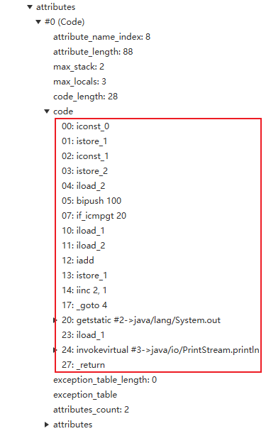
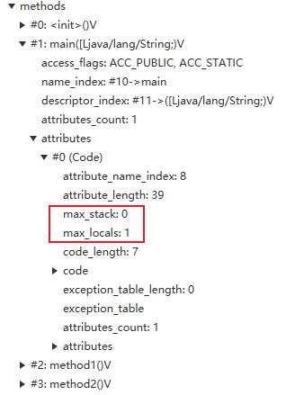
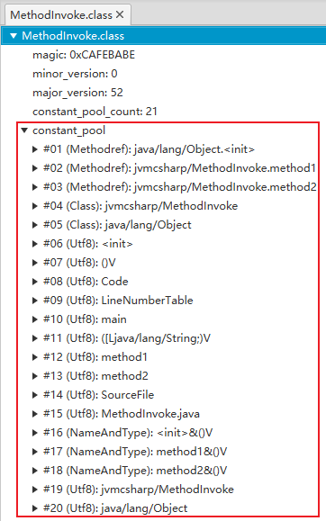
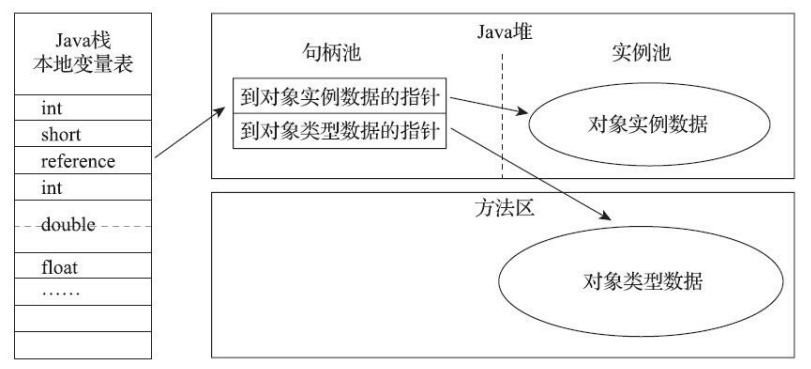
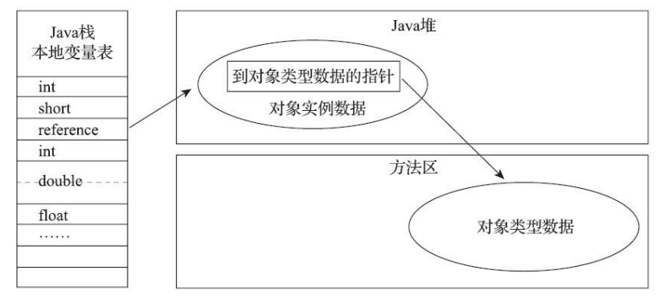

# Java内存区域

## 运行时数据区

Java虚拟机规范规定Java虚拟机所管理的内存由以下几个运行时数据区域构成



### 程序计数器

程序计数器（Program Counter Register）是一块较小内存空间，它可以看作是当前线程所执行的字节码的行号指示器。

Java源代码编译成字节码时方法中的一行行源代码会编译成一系列Java虚拟机指令存储在字节码文件中Code属性中，如下图所示。



Java虚拟机是一条一条指令解释执行来运行Java程序的，程序计数器也可以理解为是一个指向当前线程正在运行的指令的指针。Java中方法分为Java方法（使用Java代码实现）和本地方法（使用native关键字修饰，C++实现）。由于本地方法只有方法声明没有实现，字节码的Code属性中也就不会有对应Java虚拟机指令，这时程序计数器的为空（Undefined）。

当Java程序中开启了多条线程时，由于各个线程运行情况不一，所以需要需要各个线程独立存储各自的程序计数器，各个程序计数器互不影响。因此程序计数器所占的内存属于线程私有内存。

### Java虚拟机栈

Java程序启动时会创建主线程，Java虚拟机从主类中找到主方法，执行主方法，当主方法返回时该Java程序运行结束。每创建一个Java线程时会为这个线程创建一个Java虚拟机栈，Java虚拟机栈由栈帧组成。栈帧是一个用于存储局部变量表、操作数栈、动态连接、方法出口等信息的数据结构。



每调用一个方法时创建一个栈帧并将其压入当前线程的Java虚拟机栈中，当方法执行完成时将当前方法的栈帧从Java虚拟机栈中弹出。当线程中的Java虚拟机栈中的栈帧全部弹出时，线程运行结束。以下面这段代码为例，它的执行过程如图所示：

```java
public class MethodInvoke {
    public static void main(String[] args) {
        method1();
        method2();
    }

    public static void method1() {

    }

    public static void method2() {
        method1();
    }
}
```



局部变量表中存储各种Java虚拟机基本数据类、对象引用和returnAddress类型。操作数栈用于存储字节码指令的执行结果数据。Java虚拟机在调用方法时为方法创建栈帧时，局部变量表和操作数栈的大小是固定的。它们的大小在编译器就已经由编译器计算好并固定下来存入字节码的属性表中。



这些数据类型在局部变量表中存储形式以变量槽（Slot）来表示，上述的大小指的是变量槽的个数。其中long和double类型数据占用两个变量槽，其余数据类型都只占一个。变量槽是Java虚拟机规范中定义的概念，实际占用多少内存和具体的虚拟机实现有关。

Java虚拟机规范中对Java虚拟机栈这块内存区域规定了两类异常情况：

+ StackOverflowError异常
  + 当线程请求的Java虚拟机栈深度大于虚拟机允许的栈深度时抛出
+ OutOfMemoryError异常
  + 当Java虚拟机栈扩展时无法申请到足够的内存时抛出（前提：虚拟机允许动态扩展Java虚拟机栈。HotSpot：不允许扩展）

### 本地方法栈

本地方法栈（Native Method Stacks）与虚拟机栈类似，区别只是虚拟机栈服务于Java方法（字节码），本地方法栈服务于本地方法（Native）。

### Java堆

Java堆是运行时数据区中内存最大的一块，它在虚拟机启动时创建，它是内存共享的。Java是面向对象编程语言，运行过程中需要创建大量的对象，“几乎”所有的对象实例都在Java堆分配内存。Java堆的唯一目的也就是存放对象实例。Java堆是垃圾收集器管理的内存区域，因此又被称为GC堆。

Java堆的内存既可以是连续的，也可以是不连续的（逻辑上是连续的），就好比文件系统。

Java堆既可以是固定大小的，也可以是可扩展的，根据具体虚拟机实现而定。当前主流的虚拟机都是支持堆可扩展的，通过JVM参数-Xmx和-Xms设置堆的初始大小和最大大小。当为对象分配内存时既无法完成内存分配也无法扩展时Java虚拟机将抛出OutOfMemoryError异常。

### 方法区

方法区（Method Area）用于存储被虚拟机加载的类型信息、常量、静态变量、即时编译器编译后的代码缓存等数据的一块内存区域，它是线程共享的。方法区描述为堆的一个逻辑区，但为了与Java堆区分开也有了一个别名“非堆”（Non-Heap）。

Java虚拟机规范对方法区的约定非常宽松，不需要连续内存空间、可选择固定大小或可扩展，甚至可以不实现垃圾回收。方法区的垃圾回收主要针对常量池的回收和对类型的卸载，回收条件非常苛刻。

### 运行时常量池

运行时常量池（Runtime Constant Pool）是方法区的一部分。字节码中有一项信息是常量池表（Constant Pool Table），用于存放编译器生成的各种字面量和符号引用，这些数据会在类加载后存放到运行时常量池中。另外由符号引用翻译出来的直接引用也会存储在运行时常量池中。



运行时产生的常量也会被放入运行时常量池中，比如：String.intern()方法

> String类的intern方法，试图将自身实例放入常量池中然后返回，如果常量池中已存在该常量则从池中取值返回。

### 直接内存

直接内存（Direct Memory）不是虚拟机运行时数据区的一部分，但是它被频繁地使用。JDK1.4引入的NIO（New Input/Output）类可以使用Native函数库直接分配堆外内存，通过DirectByteBuffer对象操作这块堆外内存。

直接内存虽然不受Java堆内存大小的限制，但是还是会受到本机总内存大小和处理器寻址空间的限制。设置-Xmx等参数时，千万不能忽略直接内存，不然使得各个内存区域总和大于物理内存限制时，使用直接内存时无法动态扩展导致OOM。

## 对象探秘

### 对象的创建

一个普通对象的常规创建过程：（不包括数组、Class对象，以及通过克隆、反序列化方式创建的对象）



> 数组可以是多维的并且数组元素的类型也是不确定的，因此没有对应的Class文件，数组的类是Java虚拟机运行过程中生成。
> 
> Class类没有公开的构造方法可用，Class对象是对应类加载后由Java虚拟机创建的。


### 对象的内存布局

HotSpot虚拟机中，对象的内存布局分为三个部分：
1. 对象头（Header）
2. 实例数据（Instance Data）
3. 对齐填充（Padding）

#### 对象头

对象由两部分组成：

1. 用于存储对象自身的运行是数据（Mark Word）
   1. 哈希码
   2. GC分代年龄
   3. 锁状态标志
   4. 线程持有的锁
   5. 偏向锁ID
   6. 偏向时间戳
   7. ...
2. 指向它的类型元数据的指针
   1. 记录对象实例是属于那个类的
   2. 数组类型对象还要有一块用于记录数组长度的数据

#### 实例数据

存储对象真正的有效信息，即源码中定义的各种类型的字段（包含从父类继承下来的字段）

#### 对齐填充

这部分是分必须的，它的作用仅仅是占位符。在HotSpot虚拟机中要求对象其实地址必须是8字节的整数倍，这时就需要使用对齐填充来达到这个目的。

### 对象的访问定位

访问对象时，通过栈上的reference数据操作堆上的具体对象。reference类型是Java虚拟机规范中定义的指向对象的引用的一个概念，具体实现有具体虚拟机完成。

主流的访问方式有两种：

1. 通过句柄访问
   
   Java堆中划分出来一块区域，称为句柄池。reference存储对象的句柄地址，句柄存储对象实例数据和类型数据各自的地址。
   
   

   优点：reference不直接存储对象地址，当对象在内存中发生位置移动时（垃圾回收时移动对象非常普遍），只需要改变句柄中对象的指针，不需要对栈上的reference进行修改
   
2. 通过直接指针访问（HotSpot中最为主要方式）
   
   reference直接存储对象的地址

   

   优点：通过reference存储对象地址直接访问对象，访问速度快