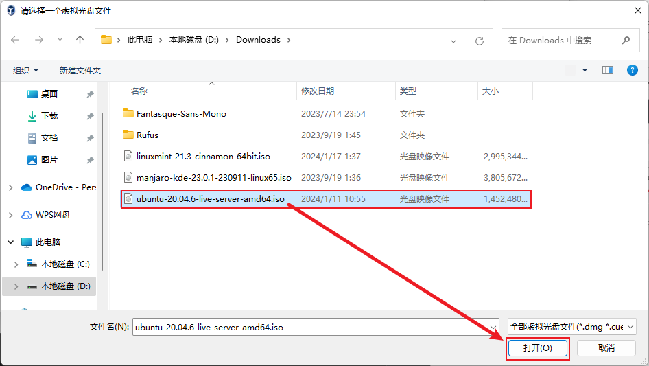
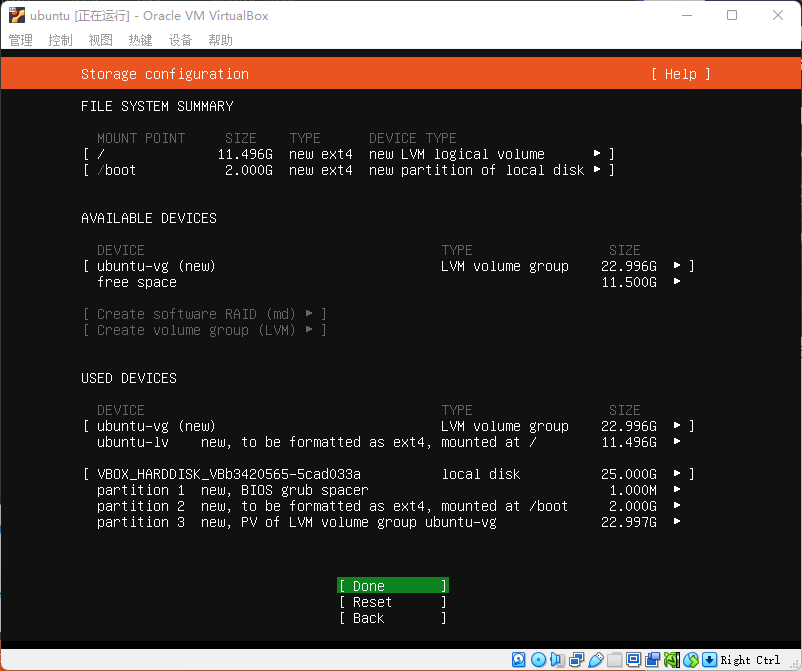

# VirtualBox安装Ubuntu20.04(server)虚拟机

## 下载并安装VirtualBox

[VirtualBox官网下载页](https://www.virtualbox.org/wiki/Downloads)

点击下载好的VirtualBox安装包，一路点击“下一步”，留意安装位置，直到最后点击完成按钮。

> 根据自己电脑的操作系统，选择不同的版本进行下载安装，这里以Windows为例。

## 下载Ubuntu系统镜像

[清华大学开源软件镜像站](https://mirrors.tuna.tsinghua.edu.cn/ubuntu-releases/20.04/)

选择`ubuntu-20.04.6-live-server-amd64.iso`进行下载

## 新建虚拟机

1. 打开VirtualBox并点击新建
   
   

2. 设置虚拟机名称、存放路径、系统类型等，点击下一步
   
   

3. 虚拟机的内存、CPU、显存，参数可依据使用目的自行设置，然后点击完成。
   
   
   
   

## 安装虚拟机

1. 选中刚刚创建的虚拟机，点击设置

   

2. 点击存储、没有盘片、选择虚拟盘

   

3. 选择之前下载好的镜像文件

   

4. 配置网络

   1. 依次点击网络、网卡1、启用网络连接、网络地址转换（NAT）

   

   2. 依次点击网络、网卡2、启用网络连接、仅主机（Host-Only）网络、确定

   

## 启动虚拟机

1. 选中刚刚创建的虚拟机、点击启动

   

2. 选择语言

   

3. 忽略系统更新

   

4. 选择键盘布局

   

5. 网络配置

   

6. 代理网络配置

   

7. 镜像下载地址配置，默认为ubuntu官网（访问速度慢），改为清华大学的镜像地址（访问速度快）。地址：http://mirros.tuna.tsinghua.edu.cn/ubuntu

   

8. 引导存储配置

   

9.  存储配置

   

10. 继续

    

11. 配置账号信息

    

12. 安装SSH

    

13. 特定服务

    

14. 等待相关文件下载完成

    

15. 下载完成选择重启

    

## 登录账号

1. 输入之前创建的账号和密码进行登录

   

2. 登录成功

   

## 测试网络

### 测试虚拟机访问主机网络

1. 输入`ping www.baudi.com`测试能否访问主机的网络

   

### 测试主机访问虚拟机

1. 安装`net-tools`工具

   

   1. 输入命令`sudo apt install net-tools`
   2. 输入密码

2. 查询虚拟机ip

   

   1. 输入命令`ifconfig |grep inet`
   2. 查找虚拟机ip，通常是192.xxx.xxx.xxx

3. 使用`Xshell`、`MobaXterm`等终端工具连接虚拟机，以`MobaXterm`为例

   

   1. 填写刚刚查询到的虚拟机ip
   2. 填写账号

4. 输入密码

   

5. 登录成功

   

## 导出虚拟机

1. 选中虚拟机，右键、停止、正常关机

   

2. 选择工具、点击导出

   

3. 选择需要导出的虚拟机

   

4. 选择导出路径、其他默认即可

   

5. 修改虚拟机导出设置，点击完成

   

6. 导出完成后会在导出目录下生成一个`xxx.ova`文件
   

7. 保存好文件以便将其导入到其他计算机上使用

## 导入虚拟机

1. 选择工具、点击导入

   

2. 选择ova文件，点击下一步

   

3. 配置虚拟机导入设置，配置一下默认虚拟电脑位置，其他保持默认即可，点击完成

   

4. 导入完成

   